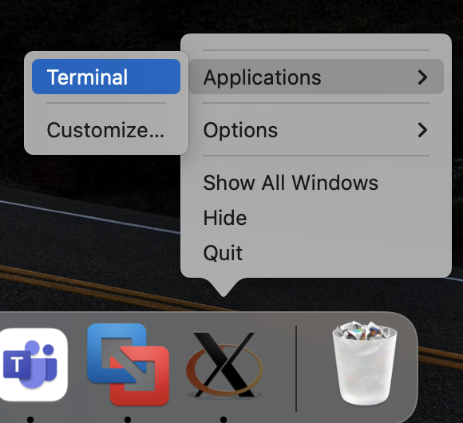

## Windows

#### Software Preparation

1. Download and install [PuTTY](https://www.putty.org/).
2. Download and install [Xming](https://sourceforge.net/projects/xming/).
3. Run Xming.

#### PuTTY SSH Setup

1. Open PuTTY and enter `24.199.78.229` in the `Host Name (or IP Address)` box.
2. In the side menu, select `Connectoin` - `SSH` - `X11`, then click and check `Enable X11 forwarding`.
3. Click `Open` button in the bottom to log into the VPS (username and password: `ndss24`).
4. Lastly, SSH into the AE server through command: `ssh -X -p 2222 ndss24_ae@localhost`.

## macOS

#### Software Preparation

- Install [`XQuartz`](https://www.xquartz.org/) via `brew`

    ```zsh
    brew install --cask xquartz
    ```

#### SSH into the AE Server

- Open the `XQuartz` terminal as shwon in Figure 1 (Right click -> Applications -> Terminal)

  

- Then, SSH into the AE server (It seems that `XQuartz` does not support Copy and Paste):

    ```shell
    ssh -X ndss24@24.199.78.229  # password: ndss24
    ssh -X -p 2222 ndss24_ae@localhost
    ```

#### Miscellaneous

- Never mind if the error message `X Error: BadAccess` appears when running IPEA-San unit test and IPEA-Fuzz.
